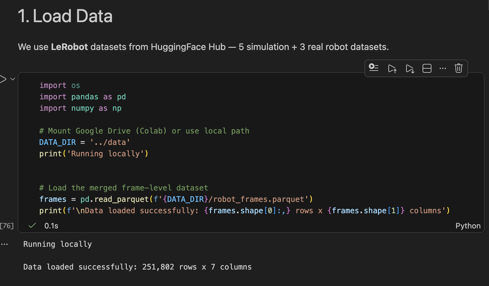
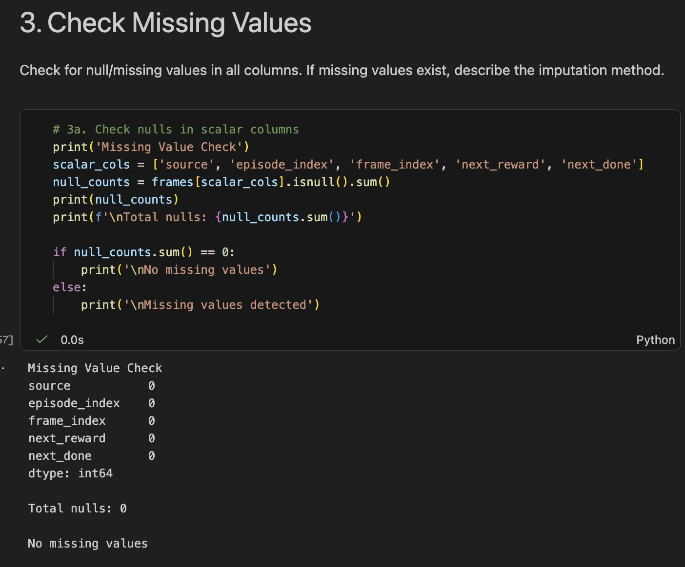
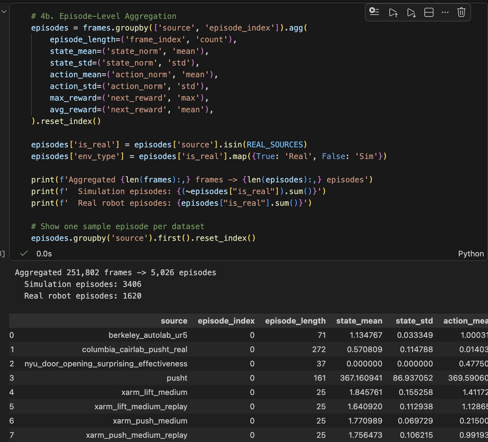

# 课堂报告：机器人演示质量分析

**团队：** Alex's Group
**日期：** 2026年3月25日
**数据集：** LeRobot (HuggingFace) — 8个数据集，共251,802帧

---

## 1. 加载数据

我们使用 `datasets` 库从 HuggingFace 加载了 **8个 LeRobot 数据集**，涵盖仿真和真实机器人两种环境。

**数据来源：** HuggingFace Hub 上的 `lerobot/*` [1]
**格式：** 每个数据集通过 `load_dataset(name, split='train')` 加载，转换为 Pandas DataFrame 后保存为 Parquet 文件。

| 分组 | 数据集 | 帧数 | Episode数 |
|------|--------|------|-----------|
| 仿真 | `lerobot/pusht` | 25,650 | 206 |
| 仿真 | `lerobot/xarm_lift_medium` | 20,000 | 100 |
| 仿真 | `lerobot/xarm_lift_medium_replay` | 20,000 | 100 |
| 仿真 | `lerobot/xarm_push_medium` | 20,000 | 100 |
| 仿真 | `lerobot/xarm_push_medium_replay` | 20,000 | 100 |
| 真实机器人 | `lerobot/berkeley_autolab_ur5` | 97,939 | 1,000 |
| 真实机器人 | `lerobot/columbia_cairlab_pusht_real` | 27,808 | 150 |
| 真实机器人 | `lerobot/nyu_door_opening_surprising_effectiveness` | 20,405 | 200 |
| **合计** | | **251,802** | **~1,956** |

**加载代码：**



所有数据集合并为一个 `robot_frames.parquet` 文件，便于统一分析。

---

## 2. 检查数据大小与特征类型

### 数据规模
- **总帧数：** 251,802
- **总Episode数：** ~1,956
- **每帧列数：** 7

### 数据模式（列名与类型）

| 列名 | 类型 | 说明 |
|------|------|------|
| `source` | string | 数据集名称（如 `pusht`、`berkeley_autolab_ur5`） |
| `episode_index` | int | 第几次演示任务 |
| `frame_index` | int | 该次任务中的第几帧 |
| `observation_state` | list[float] | 机器人状态向量（因数据集不同为2D–8D） |
| `action` | list[float] | 动作指令向量（因数据集不同为2D–7D） |
| `next_reward` | float | 当前帧的奖励信号 |
| `next_done` | bool | 是否为该Episode的最后一帧 |

### 特征维度（因数据集而异）

| 数据集类型 | 状态维度 | 动作维度 | 示例 |
|-----------|---------|---------|------|
| PushT（仿真） | 2D | 2D | 二维位置 |
| xArm（仿真） | 4D | 3–4D | 关节角度 |
| 真实机器人 | 8D | 7D | 完整关节状态 + 夹爪 |

> **注意：** 由于不同数据集维度不同，我们使用 **L2范数（模长）** 来创建与维度无关的特征。

---

## 3. 检查缺失值与填补方法

### 缺失值检查

我们对所有列进行了空值检查：



**结果：未发现任何缺失值。**


### 填补方法

**无需填补。** LeRobot 是经过良好整理的研究数据集，数据完整。所有 251,802 帧的每一列都有有效值。

---

## 4. 数据预处理

### 4.1 L2范数变换
由于状态/动作维度不一（2D到8D），我们对每帧计算 **L2范数** 以生成与维度无关的标量特征：

```python
frames['state_norm'] = frames['observation_state'].apply(
    lambda x: float(np.linalg.norm(x)))
frames['action_norm'] = frames['action'].apply(
    lambda x: float(np.linalg.norm(x)))
```

### 4.2 Episode级聚合
因为我们要判断的是一整条轨迹的质量好不好，而不是某一帧好不好。基于此我们进行压缩。

原始数据为**帧级**（251,802行），我们使用 PySpark 聚合到**Episode级**（~1,956行）：
- 基础统计量：状态/动作范数的均值、标准差、最小值、最大值
- Episode长度（每个Episode的帧数）
- 每个Episode的最大/平均奖励



### 4.3 特征工程（通过PySpark计算32个运动学特征）
已有研究表明，演示质量比数量更重要 [2]，且筛选高质量数据可以显著提升策略训练效果。Luo et al. (2024) [3] 进一步发现 path_length 和 jerk 是预测学习效果最强的指标。

原始数据只有7列（source、episode_index、frame_index、state、action、reward、done），信息量有限。参考上述文献，我们从运动轨迹中提取了32个运动学特征，从不同角度描述一条轨迹的特点（如平滑度、路径效率、动作一致性等），帮助模型更准确地区分高质量与低质量演示。

我们构建了 **32个基于运动的特征**，包括：

| 类别 | 特征 | 数量 |
|------|------|------|
| 基础统计 | 状态/动作的均值、标准差、最小值、最大值、范围 | 10 |
| 平滑度 | 动作差分、jerk（均值/最大值） | 3 |
| 路径质量 | 路径效率、总路径长度 | 2 |
| 一致性 | 动作一致性、修正次数 | 2 |
| 时序特征 | 速度（均值/标准差/最大值）、状态/动作趋势、自相关 | 7 |
| 阶段分析 | 前期/后期动作均值、热身比 | 3 |
| 终态特征 | 最终稳定性、状态净变化、最终偏差 | 3 |
| 能量 | 动作能耗（L2²均值） | 1 |
| 多样性 | 状态多样性 | 1 |

### 4.4 质量标签定义（双标签）

```python
# 仿真数据：基于奖励
reward_quality = (max_reward > per_dataset_median).astype(int)

# 真实机器人：基于效率（所有奖励均为1.0）
efficiency_quality = (episode_length < per_dataset_median).astype(int)
```

### 4.5 使用工具
- **PySpark** 用于分布式聚合与特征计算
- **Pandas** 用于数据读写与后处理
- **NumPy** 用于向量范数计算

---

## 5. 后续步骤

1. **分类建模** — 基于32个特征训练并比较4个模型：
   - 决策树（PySpark MLlib）
   - 梯度提升树（PySpark MLlib）
   - 随机森林（PySpark MLlib）
   - MLP 神经网络（PyTorch）

2. **模型评估** — 使用 AUC-ROC、准确率、精确率、召回率进行评估

3. **仿真到真实分析** — 对比仿真版与真实版，检验质量模式是否跨域迁移

4. **最终报告与展示** — 整理研究发现为PDF报告和演示幻灯片（截止日期：4月3日）

---

## 参考文献

[1] Cadene, R. et al. "LeRobot: State-of-the-art Machine Learning for Real-World Robotics in Pytorch." HuggingFace, 2024. https://huggingface.co/lerobot

[2] Mandlekar, A. et al. "What Matters in Learning from Offline Human Demonstrations for Robot Manipulation." *CoRL 2021*.

[3] Luo, J. et al. "Consistency Matters: Defining Demonstration Data Quality Metrics." 2024.
